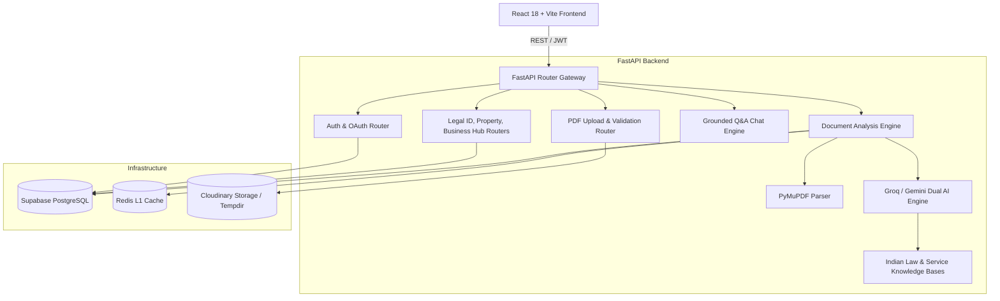

# SmartLegal AI — System Architecture & Component Design

## 1. Executive System Overview

SmartLegal AI is built as a decoupled, high-performance web application designed for legal document analysis, plain-language translation (English & Hindi), risk scoring, and interactive Q&A grounded in Indian jurisprudence.



---

## 2. Frontend Component Architecture

The frontend is an SPA constructed with React 18, TypeScript, Redux Toolkit, and Tailwind CSS with a dark glassmorphic design system.

### Redux Store Structure (`src/store/`)
- **`authSlice.ts`**: Manages user authentication state, JWT storage, profile fetching (`GET /auth/me`), and Google Identity Services sign-in.
- **`documentSlice.ts`**: Manages active uploaded document, upload progress, history list, and comparison mode documents.
- **`analysisSlice.ts`**: Handles document analysis triggers and async polling logic (`pollUntilDone` against `GET /analyze/:id/status`).
- **`chatSlice.ts`**: Maintains conversation history for document-grounded Q&A.
- **`legalIdSlice.ts`**, **`propertySlice.ts`**, **`businessSlice.ts`**: Manage government service catalogs, user application trackers, and interactive checklists.

### Core UI Flow & Views
1. **Header & Layout (`Layout.tsx`)**: Sticky glassmorphic header, active user dropdown, network offline notification banner, and quick navigation.
2. **Upload View (`Upload.tsx`)**: Drag-and-drop PDF dropzone (`react-dropzone`), instant client-side file preview frame (`URL.createObjectURL`), progress bar, and analysis kick-off.
3. **Analysis Cockpit (`Analysis.tsx`)**: Risk score overview, metrics breakdown (High/Medium/Low counts), Party Rights & Obligations, and `ClauseCard` components featuring the English / Hindi toggle.
4. **Chat Interface (`Chat.tsx`)**: Grounded document Q&A assistant thread with suggested prompt pills and citation references.
5. **Civic Service Hubs (`ServicesHub.tsx`, `LegalIdHub.tsx`, `PropertyHub.tsx`, `BusinessHub.tsx`)**: Specialized legal guidance portals with step-by-step application requirements, timelines, official links, and checklist progress tracking (`ServiceTracker.tsx`).

---

## 3. Backend Architecture & API Gateway

The backend uses FastAPI (Python 3.12) with asynchronous non-blocking I/O (`asyncpg`, `httpx`, `redis.asyncio`).

### API Router Organization (`backend/routers/`)
- `auth.py`: Registration, password login, current user lookup (`/auth/me`).
- `auth_google.py`: Google OAuth 2.0 ID token validation against Google tokeninfo servers.
- `upload.py`: PDF upload, magic-byte verification (`%PDF`), size restriction (10MB), and Cloudinary / tempfile storage routing.
- `analyze.py`: Analysis trigger, L1 Redis cache lookup, L2 PostgreSQL cache lookup, background task queuing, and status polling.
- `chat.py`: Grounded Q&A endpoint utilizing document text context.
- `legal_id.py`, `property.py`, `business.py`: Civic service guidance catalogs and application tracking APIs.

---

## 4. AI & LLM Processing Pipeline

```
[ Uploaded PDF ]
       │
       ▼
[ PyMuPDF Parser ] ──► Text Extraction + Page Markers [Page 1], [Page 2]
       │
       ▼
[ Document Classifier ] ──► Keyword Scoring (16 Document Types)
       │
       ▼
[ Text Chunker ] ──► ~12,000 character segments
       │
       ▼
[ Dual LLM Engine ] ──► Primary: Groq (llama-3.3-70b-versatile)
       │                 Fallback: Gemini 2.5 (gemini-2.0-flash)
       │                 + Indian Law Knowledge Base Injection
       ▼
[ Structured JSON Output ] ──► Summary + Clause-by-Clause Analysis + Risk Scores + Hindi Explanations
```

### Knowledge Base Modules (`backend/services/`)
- `indian_law_kb.py`: Comprehensive Indian legal rules engine covering Transfer of Property Act, Contract Act, Consumer Protection Act, Rent Control Acts, Labor Codes, and Bharatiya Nyaya Sanhita.
- `legal_id_kb.py`, `property_kb.py`, `business_kb.py`: Detailed requirements, fees, official portals, FAQs, and default checklist items for Indian civic services.
