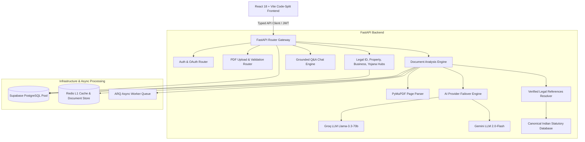

# SmartLegal AI — System Architecture & Component Design (SL-054 Sync)

## 1. Executive System Overview

SmartLegal AI is built as a decoupled, high-performance web application designed for legal document analysis, plain-language translation (English & Hindi), risk scoring, and interactive Q&A grounded in Indian jurisprudence.

---

## 2. Frontend Architecture & Performance (`frontend/src/`)

- **Routing & Code-Splitting (`App.tsx`)**: All 18+ page routes are lazy-loaded via `React.lazy()` and `<Suspense fallback={<PageFallback />}>`, reducing initial JS bundle size from 1,188 KB to 296 KB.
- **Single Typed API Layer (`src/services/typedApi.ts`)**: Centralizes HTTP calls (`authApi`, `documentApi`, `analysisApi`, `chatApi`, `advisorApi`, `yojanaApi`) behind a uniform Axios client with JWT refresh interceptors.
- **Glassmorphic Toast Provider (`src/components/ToastProvider.tsx`)**: Accessible application-wide toast notification system (`showToast()`) replacing legacy browser alerts.
- **Feature Domain Architecture (`src/features/`)**: Feature modules organized into domain folders (`features/analysis`, `features/compare`, `features/knowledge`).
- **UI Primitives (`src/components/ui/`)**: Reusable accessible components (`Modal.tsx`, `Skeleton.tsx`, `StatusBadge.tsx`, `EmptyState.tsx`).

---

## 3. Backend AI Pipeline & Resiliency (`backend/services/`)

1. **`AIOrchestrator` (`ai_provider.py`)**: Abstract provider interface (`BaseAIProvider`) supporting primary Groq execution with automatic failover to Gemini `gemini-2.0-flash` on rate-limits (429) or API timeouts.
2. **`PromptRegistry` (`prompt_registry.py`)**: Versioned prompt templates (`v1.0.0`) with rigid XML boundaries (`<untrusted_document_content>`, `<user_question>`) and safety headers.
3. **`AIParser` (`ai_parser.py`)**: Robust JSON extraction, markdown code block stripping, trailing comma syntax repair, and Pydantic schema validation.
4. **`LegalReferenceService` (`legal_reference_service.py`)**: Canonical Indian statutory database (BNS 2023, BNSS 2023, BSA 2023, Contract Act, TPA, NI Act s.138, RERA) verifying section citations.
5. **`LegalRetrievalService` (`legal_retrieval_service.py`)**: Reusable legal search engine (`search_legal_corpus()`) providing domain-filtered statutory retrieval.
6. **`Worker` (`worker.py`)**: ARQ background worker managing the `analysis_jobs` lifecycle (`queued` → `extracting` → `ocr` → `analyzing` → `completed` / `failed`) with Redis persistence.

---

## 4. Security & Hardening Model

- **JWT + HttpOnly Cookies (`auth.py`)**: Double auth protection reading `Authorization: Bearer` headers with fallback to `sl_token` HttpOnly, SameSite=Lax cookies.
- **Object-Level Ownership (IDOR Protection)**: 100% backend enforcement on all 24 protected endpoints verifying `document.user_id == current_user.id`.
- **Upload Hardening (`upload.py`)**: 10MB streaming size validation, binary magic-byte verification (`%PDF`, `JPEG`, `PNG`, `WEBP`), SHA-256 file hashing deduplication, and max 50-page PDF limit check.
- **Rate Limiting (`limiter.py`)**: Per-user rate limiting key function `get_user_or_ip_key` enforcing a maximum of 3 concurrent active document analysis jobs per user.
