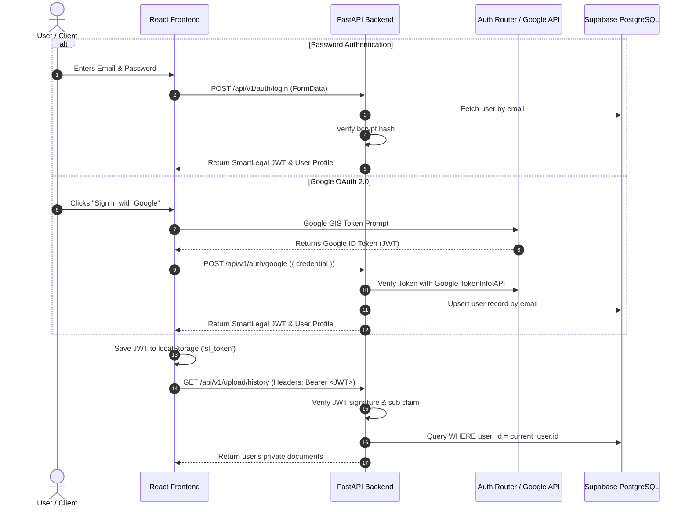

# SmartLegal AI — Authentication & Security Architecture

## 1. Overview & Auth Strategy

SmartLegal AI enforces a robust security architecture combining **JWT Bearer Token Authentication**, **Google OAuth 2.0 Identity Services**, **bcrypt Password Hashing**, and **Route-Level Ownership Verification (Phase 4D)**.



---

## 2. Authentication Mechanisms

### 1. Password Hashing (bcrypt)
- Managed via `passlib.context.CryptContext` with `bcrypt`.
- Input passwords are restricted to $\le 72$ bytes to prevent silent bcrypt truncation vulnerabilities.
- Password minimum length is enforced at 8 characters via Pydantic `field_validator`.

### 2. JWT Bearer Tokens
- Tokens are signed using `python-jose` with the `HS256` algorithm.
- Token claims:
  - `sub`: User UUID string.
  - `exp`: Expiration time set to 7 days (10,080 minutes) by default (`ACCESS_TOKEN_EXPIRE_MINUTES`).
- Token is stored client-side in `localStorage.getItem('sl_token')` and attached to all outbound Axios requests via request interceptor.

### 3. Google OAuth 2.0 Integration (`auth_google.py`)
- Endpoint: `POST /api/v1/auth/google`.
- The backend verifies incoming Google ID Tokens directly against `https://oauth2.googleapis.com/tokeninfo`.
- Security checks enforced:
  1. Token signature verified by Google.
  2. Audience (`aud`) claim matches configured `GOOGLE_CLIENT_ID`.
  3. Issuer (`iss`) matches `accounts.google.com` or `https://accounts.google.com`.
  4. Google flag `email_verified == True`.
- New OAuth users are automatically registered in PostgreSQL with an empty password field.

---

## 3. Phase 4D: Route-Level Access Control & Ownership Verification

All 24 protected endpoints enforce strict resource ownership checks using FastAPI `Depends(get_current_user)` and database query constraints (`WHERE user_id = $1`).

### Standard Ownership Verification Pattern
```python
@router.get("/{document_id}", response_model=DocumentOut)
async def get_document(
    document_id: str,
    db=Depends(get_db),
    current_user=Depends(get_current_user),
):
    row = await db.fetchrow(
        "SELECT * FROM documents WHERE id = $1", document_id
    )
    if not row:
        raise HTTPException(status_code=404, detail="Document not found.")

    # Ownership enforcement
    if row["user_id"] != current_user["id"]:
        raise HTTPException(status_code=403, detail="You do not have permission to access this document.")

    return DocumentOut(**row)
```

### Secured Endpoint Inventory (24 Routes)
- **Document Routes**: `POST /upload`, `GET /upload/history`, `GET /upload/{id}`.
- **Analysis Routes**: `POST /analyze`, `GET /analyze/{id}/status`, `DELETE /analyze/{id}/cache`.
- **Chat Routes**: `POST /chat`, `GET /chat/{id}/history`.
- **Legal ID Hub Routes**: Application creation, retrieval, patch, delete, and checklist endpoints.
- **Property Hub Routes**: Application creation, retrieval, patch, delete, and checklist endpoints.
- **Business Hub Routes**: Application creation, retrieval, patch, delete, and checklist endpoints.

### Frontend Route Guards (`ProtectedRoute.tsx`)
- Private routes (`/upload`, `/analysis`, `/chat`, `/compare`, `/documents`, `/tracker`) are wrapped in `<ProtectedRoute>`.
- If no token is found in Redux state or `localStorage`, the user is redirected via `<Navigate to="/login" replace />`.
